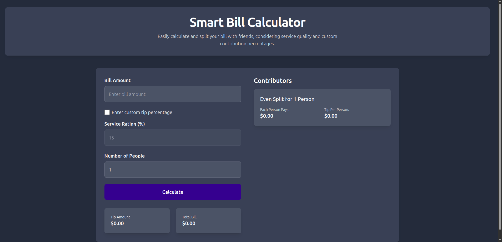
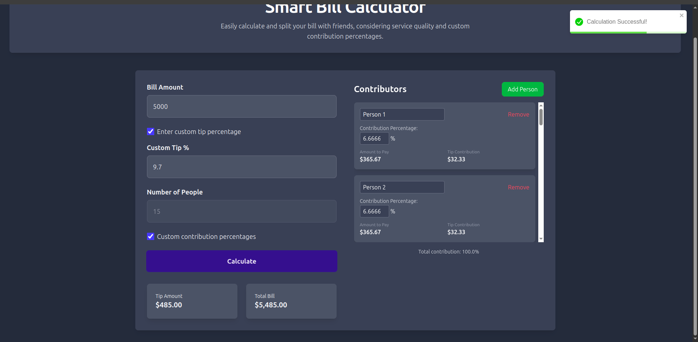

# Smart Bill Calculator

A modern React application for easily splitting bills and calculating tips among multiple people.

## Overview

The Smart Bill Calculator provides an intuitive interface for calculating and distributing bill payments among friends, roommates, or colleagues. It supports both even splits and custom contribution percentages, making it ideal for various bill-sharing scenarios.

## Features

- 🧮 **Bill Amount Calculation**: Enter the total bill amount
- 💰 **Tip Calculation**: Choose between default and custom tip percentages
- 👥 **Multiple Contributors**: Split bills among any number of people
- 🔄 **Custom Contributions**: Set individual contribution percentages for uneven splits
- 🎯 **Real-time Feedback**: Instant notifications and validation messages
- 📱 **Responsive Design**: Works on desktop and mobile devices

## Technologies Used

- React
- Formik (form state management)
- Yup (form validation)
- React-Toastify (notifications)
- Tailwind CSS (styling)

## Installation

1. Clone the repository:
   ```bash
   git clone https://github.com/NelushGayashan/smart-bill-calculator.git
   cd smart-bill-calculator
   ```

2. Install dependencies:
   ```bash
   npm install
   ```

3. Start the development server:
   ```bash
   npm start
   ```

4. Open your browser and navigate to:
   ```
   http://localhost:5173
   ```

## Usage

1. Enter the bill amount in the first field.
2. Choose whether to use the default 15% tip or enter a custom percentage.
3. Specify the number of people sharing the bill.
4. For uneven splits, enable "Custom contribution percentages" and adjust individual percentages.
5. Click "Calculate" to see the results.

## Screenshots




## Code Structure

The application is built around a single Calculator component that handles:
- Form state management using Formik
- Validation with Yup
- Contributors state management
- Calculation logic for bill splitting

## Contributing

Contributions are welcome! Please feel free to submit a Pull Request.

1. Fork the repository
2. Create your feature branch (`git checkout -b feature/amazing-feature`)
3. Commit your changes (`git commit -m 'Add some amazing feature'`)
4. Push to the branch (`git push origin feature/amazing-feature`)
5. Open a Pull Request

## License

This project is licensed under the MIT License - see the LICENSE file for details.

## Future Enhancements

- Currency selection
- Bill history tracking
- Receipt scanning functionality
- Dark/light theme toggle
- Export results to PDF or share via messaging apps